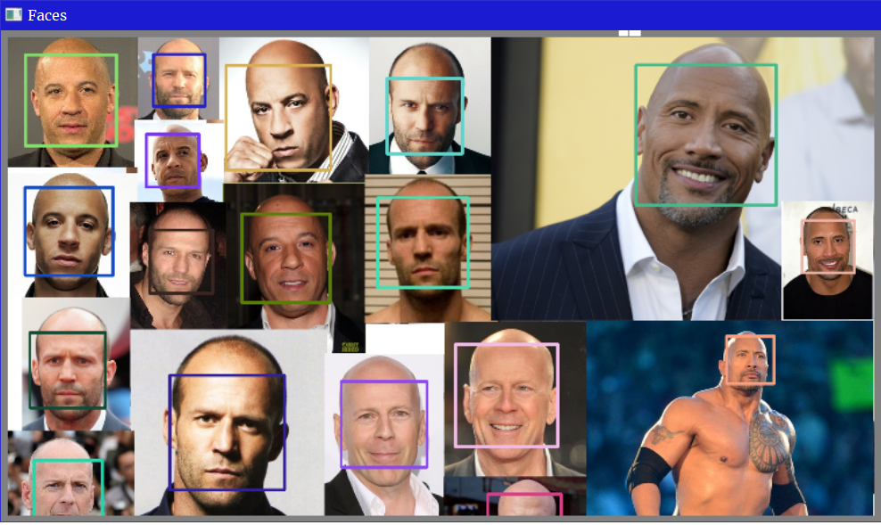
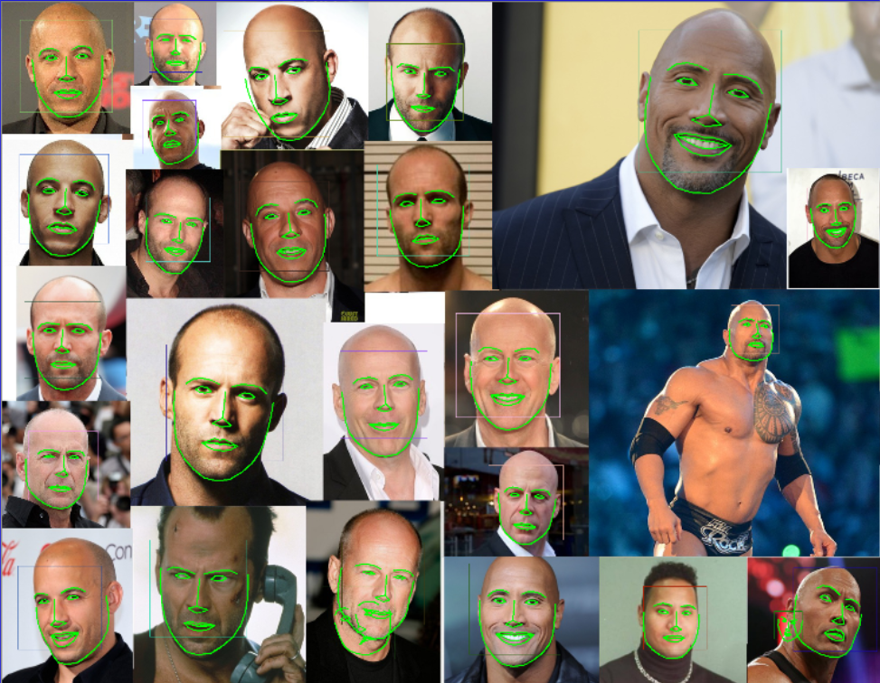
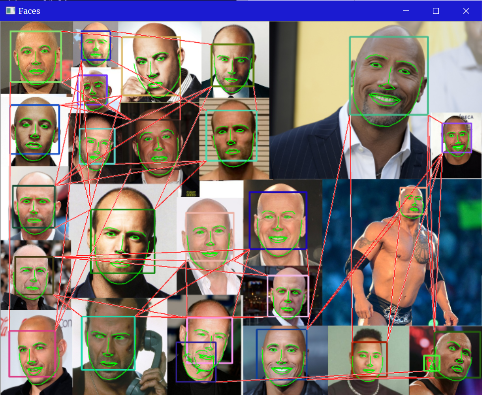

# High Quality Face Recognition with Deep Metric Learning

Presented by Dr. Leonardo Chang on the Deep Learning Workshop 2019 held at ITESM, based on the Davis' King [blog](http://blog.dlib.net/2017/02/high-quality-face-recognition-with-deep.html).

You can see the whole video session [here](videos/Leonardo%20Chang%20-%2028Jun2019.mp4).

### STEP 1: Detect faces

### STEP 2: Compute face descriptor

### STEP 2.1: Detect landmarks

### STEP 2.2: Align face image and obtain face descriptor

### STEP 3: Compute distance for faces M:M

## Recommended readings

- [Professional CMake: A Practical Guide](https://crascit.com/professional-cmake/).
- [Learning OpenCV 3: Computer Vision in C++ with the OpenCV Library](https://www.amazon.com.mx/Learning-OpenCV-Computer-Vision-Library/dp/1491937998?source=ps-sl-shoppingads-lpcontext&psc=1).
- Davis' King [dlib](https://github.com/davisking/dlib).